# Capstone Engineering Project (CEP) Report

## LaborLink - Complete Labor Marketplace Platform

---

**Course:** Computer Engineering Program - 5th Semester  
**Project Type:** Full-Stack Web Application  
**Date:** January 2026  
**Institution:** The Islamia University of Bahawalpur

---

## Abstract

Labor-Link is a full-stack web-based application developed to address the common challenges faced in hiring domestic and small-scale industrial labor. In many regions, labor hiring is informal, leading to issues such as unclear wage agreements, poor communication, lack of scheduling, and absence of work records. The Labor-Link application provides a digital platform where users can register as either laborers or hirers, create detailed profiles, define services with wage expectations, and schedule work through mutually agreed time slots. 

The system is implemented using **FastAPI** for backend development, **React.js** for frontend design, and **SQLite** for database management. This project demonstrates how modern web technologies can be used to improve transparency, efficiency, and trust in labor-hirer interactions. The platform features comprehensive authentication, role-based access control, real-time messaging, hiring request management, and a review/rating system that ensures quality assurance and trust-building between workers and hirers.

---

## Table of Contents

1. [Introduction](#1-introduction)
2. [Problem Statement](#2-problem-statement)
3. [Objectives of the Project](#3-objectives-of-the-project)
4. [System Overview](#4-system-overview)
5. [System Architecture](#5-system-architecture)
6. [Database Design](#6-database-design)
7. [API Design](#7-api-design)
8. [Frontend Design](#8-frontend-design)
9. [System Workflows and Flow Diagrams](#9-system-workflows-and-flow-diagrams)
10. [Technology Stack](#10-technology-stack)
11. [Implementation Details](#11-implementation-details)
12. [Testing and Validation](#12-testing-and-validation)
13. [Results and Discussion](#13-results-and-discussion)
14. [Limitations](#14-limitations)
15. [Future Enhancements](#15-future-enhancements)
16. [Conclusion](#16-conclusion)
17. [References and Appendices](#17-references-and-appendices)

---

## 1. Introduction

In modern society, finding reliable labor for household and small-scale tasks has become increasingly challenging. Many individuals require assistance with services such as cleaning, washing, and other domestic chores, but connecting with trustworthy helpers can be difficult. At the same time, many laborers struggle to find consistent work or reach potential clients effectively.

The **Labor Link** app addresses this gap by providing a digital platform that connects clients with local labor helpers efficiently and securely. Clients can easily request the services they need, view available helpers, and hire them based on ratings and availability. Laborers, on the other hand, can create profiles, manage their availability, and receive job notifications directly through the app.

### 1.1 Background and Motivation

In today's dynamic economy, there is a growing need for platforms that efficiently connect skilled workers with potential employers. Traditional methods of finding labor services often involve intermediaries, lack transparency, and provide limited quality assurance mechanisms. The informal nature of labor hiring creates several pain points:

- **For Workers:** Difficulty in finding consistent work, reaching potential clients, and building a professional reputation
- **For Hirers:** Challenges in verifying worker reliability, unclear pricing, and lack of formal communication channels
- **For Both:** No structured system for work records, payment tracking, or dispute resolution

### 1.2 Solution Approach

By leveraging technologies like **FastAPI** for the backend, **React.js** for the frontend, and **SQLite** for database management, the app ensures a smooth and responsive user experience. The platform not only simplifies the process of hiring and offering labor but also promotes transparency, reliability, and convenience. 

**LaborLink** provides:
- A centralized marketplace for worker discovery and hiring
- Transparent worker profiles with skills, hourly rates, and ratings
- Direct messaging system for seamless communication
- Review and rating system for quality assurance
- Role-based access control for workers and hirers
- Comprehensive hiring request management with status tracking

In essence, Labor Link aims to streamline domestic labor services, benefiting both clients and workers by bridging the gap between demand and supply effectively.

---

## 2. Problem Statement

The absence of a structured digital system for labor hiring leads to several critical problems that affect both workers and hirers:

### 2.1 Key Challenges

1. **Lack of Wage Clarity**
   - No standardized pricing information
   - Frequent disputes over payment amounts
   - Difficulty in negotiating fair rates

2. **Unreliable Scheduling**
   - Informal arrangements lead to missed appointments
   - No confirmation or tracking system
   - Time wastage for both parties

3. **No Formal Work Records**
   - Absence of employment history
   - Difficulty in building professional reputation
   - No accountability or performance tracking

4. **Limited Communication**
   - No direct channel between laborers and hirers
   - Reliance on intermediaries or informal networks
   - Miscommunication about job requirements

5. **Trust and Safety Concerns**
   - No verification system for workers
   - Lack of reviews or ratings
   - Safety concerns for both parties

### 2.2 Need for Digital Solution

There is a strong need for a platform that ensures:
- Clear communication between workers and hirers
- Transparent wage negotiation and agreement
- Reliable work tracking and scheduling
- Performance-based rating system
- Formal record-keeping for all transactions

**LaborLink** addresses these challenges by providing a comprehensive digital platform that brings structure, transparency, and trust to the labor hiring process.

---

## 3. Objectives of the Project

### 3.1 Primary Objectives

The main objectives of the Labor-Link project are:

1. **Develop a Secure and User-Friendly Platform**
   - Create an intuitive interface for both workers and hirers
   - Implement robust authentication and authorization
   - Ensure data security and privacy

2. **Provide Wage Transparency**
   - Allow workers to set and display hourly rates
   - Enable hirers to offer custom rates for specific jobs
   - Maintain clear pricing information throughout the platform

3. **Enable Scheduling Through Agreed Time Slots**
   - Facilitate hiring request management
   - Track job status from request to completion
   - Allow workers to accept or reject requests

4. **Maintain Work History and Performance Records**
   - Store comprehensive job history for both parties
   - Implement review and rating system
   - Calculate and display average worker ratings

5. **Improve Overall Efficiency in Labor Management**
   - Streamline the hiring process
   - Reduce time spent searching for workers
   - Minimize communication overhead

### 3.2 Secondary Objectives

1. **Ensure Mobile Responsiveness**
   - Design responsive interface for all device sizes
   - Enable on-the-go access for workers and hirers

2. **Implement Network Accessibility**
   - Support cross-device usage
   - Enable LAN and mobile network access

3. **Create Comprehensive Documentation**
   - Provide API documentation
   - Generate user guides and technical documentation

4. **Build Scalable Architecture**
   - Design for future feature additions
   - Ensure system can handle growing user base

---

## 4. System Overview

### 4.1 Architecture Overview

Labor-Link follows a modern **client-server architecture** with clear separation of concerns:

- **Frontend (Client):** Developed using React.js, which provides an interactive and responsive user interface
- **Backend (Server):** Implemented using FastAPI, responsible for handling business logic, data processing, and API endpoints
- **Database:** SQLite is used as the relational database to store user profiles, services, jobs, hiring requests, messages, and reviews

### 4.2 System Components

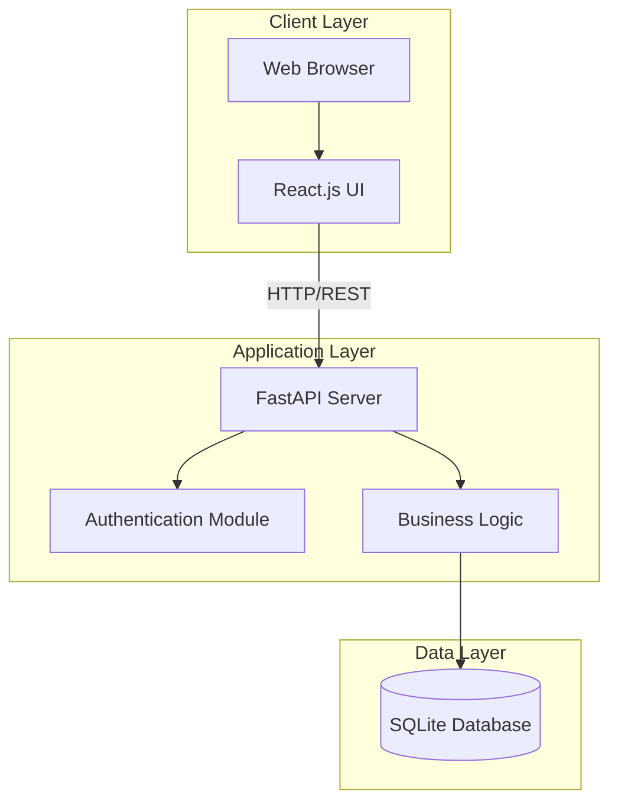

### 4.3 Communication Protocol

The frontend communicates with the backend using **RESTful APIs** with the following characteristics:

- **Data Format:** JSON (JavaScript Object Notation)
- **HTTP Methods:** GET, POST, PUT, DELETE
- **Authentication:** JWT (JSON Web Tokens)
- **Status Codes:** Standard HTTP status codes for responses

### 4.4 Key Features

1. **User Management**
   - Registration and authentication
   - Role-based access (Worker/Hirer)
   - Profile management

2. **Worker Features**
   - Profile creation with skills and rates
   - Availability management
   - Job request handling
   - Earnings tracking

3. **Hirer Features**
   - Worker search and filtering
   - Hiring request creation
   - Request tracking
   - Review submission

4. **Communication**
   - Direct messaging between users
   - Conversation history
   - Unread notifications

5. **Quality Assurance**
   - 5-star rating system
   - Written reviews
   - Average rating calculation

---

## 5. System Architecture

### 5.1 Three-Tier Architecture

The LaborLink platform follows a **three-tier architecture** that separates presentation, application logic, and data management:

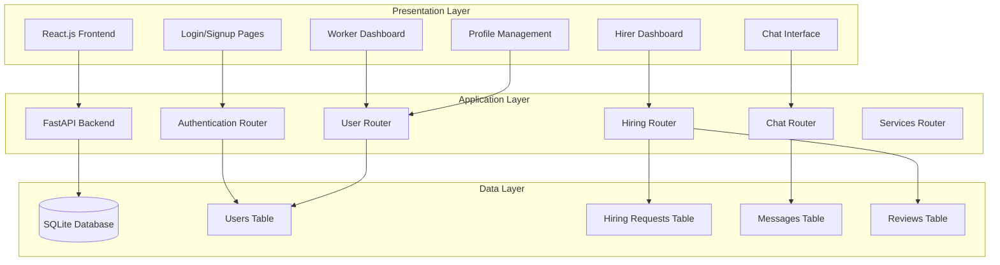

### 5.2 Component Architecture

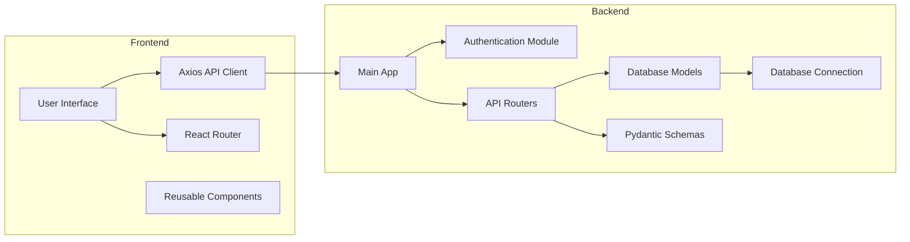

### 5.3 Request-Response Flow

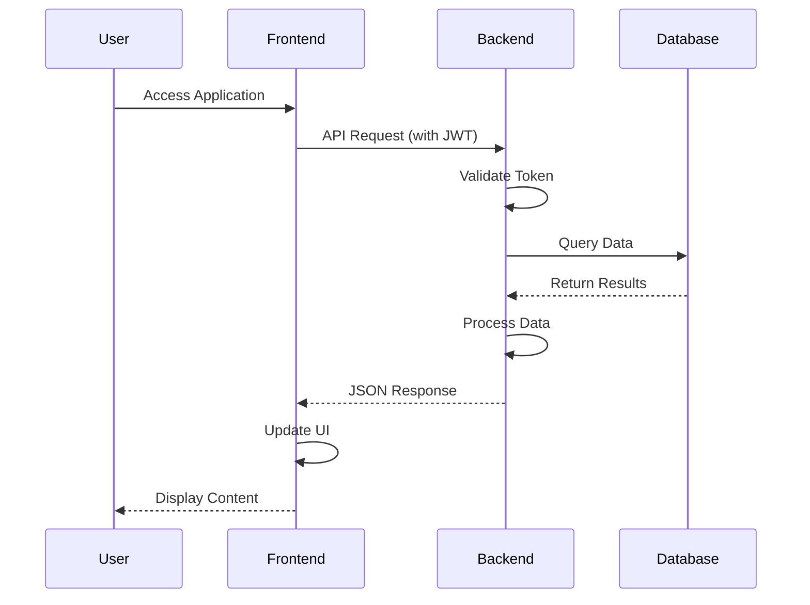

### 5.4 Security Architecture

> [!IMPORTANT]
> **Security Layers**
> - **Authentication Layer:** JWT token-based authentication
> - **Authorization Layer:** Role-based access control (RBAC)
> - **Data Layer:** Password hashing with bcrypt
> - **Transport Layer:** CORS configuration for secure cross-origin requests

---

## 6. Database Design

The database is designed to efficiently store and manage application data with proper relationships and data integrity.

### 6.1 Entity-Relationship Diagram

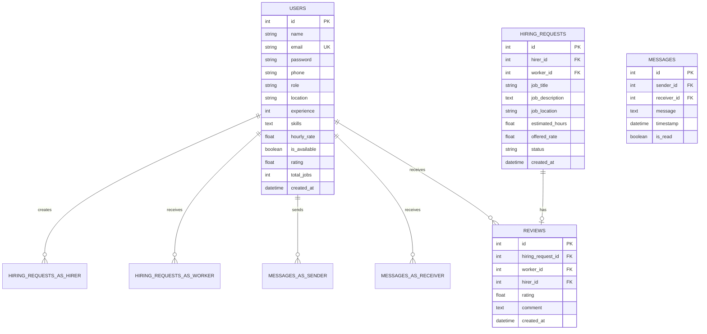

### 6.2 Database Tables

The key tables in the LaborLink database include:

1. **Users Table** - Stores profiles for both workers and hirers
2. **Hiring Requests Table** - Manages job requests and their status
3. **Messages Table** - Stores chat communication between users
4. **Reviews Table** - Contains worker ratings and feedback

Relationships between these tables ensure data consistency and enable features such as work history tracking and performance ratings.

### 6.3 Detailed Schema

#### **users Table**

| Column | Type | Constraints | Description |
|--------|------|-------------|-------------|
| id | INTEGER | PRIMARY KEY | Unique user identifier |
| name | VARCHAR | NOT NULL | User's full name |
| email | VARCHAR | UNIQUE, NOT NULL | Login credential |
| password | VARCHAR | NOT NULL | Hashed password (bcrypt) |
| phone | VARCHAR | NULLABLE | Contact number |
| role | VARCHAR | NOT NULL | 'worker' or 'hirer' |
| location | VARCHAR | NULLABLE | Geographic location |
| experience | INTEGER | DEFAULT 0 | Years of experience |
| skills | TEXT | NULLABLE | JSON array of skills |
| hourly_rate | FLOAT | NULLABLE | Worker's hourly rate |
| is_available | BOOLEAN | DEFAULT TRUE | Availability status |
| rating | FLOAT | DEFAULT 0.0 | Average rating (1-5) |
| total_jobs | INTEGER | DEFAULT 0 | Completed jobs count |
| created_at | DATETIME | DEFAULT NOW | Registration timestamp |

#### **hiring_requests Table**

| Column | Type | Constraints | Description |
|--------|------|-------------|-------------|
| id | INTEGER | PRIMARY KEY | Request identifier |
| hirer_id | INTEGER | FOREIGN KEY → users.id | Hirer user ID |
| worker_id | INTEGER | FOREIGN KEY → users.id | Worker user ID |
| job_title | VARCHAR | NOT NULL | Job title |
| job_description | TEXT | NOT NULL | Detailed job description |
| job_location | VARCHAR | NULLABLE | Job site location |
| estimated_hours | FLOAT | NULLABLE | Expected duration |
| offered_rate | FLOAT | NULLABLE | Hourly pay rate |
| status | VARCHAR | DEFAULT 'pending' | pending/accepted/rejected/completed |
| created_at | DATETIME | DEFAULT NOW | Request timestamp |

#### **messages Table**

| Column | Type | Constraints | Description |
|--------|------|-------------|-------------|
| id | INTEGER | PRIMARY KEY | Message identifier |
| sender_id | INTEGER | FOREIGN KEY → users.id | Sender user ID |
| receiver_id | INTEGER | FOREIGN KEY → users.id | Receiver user ID |
| message | TEXT | NOT NULL | Message content |
| timestamp | DATETIME | DEFAULT NOW | Send time |
| is_read | BOOLEAN | DEFAULT FALSE | Read status |

#### **reviews Table**

| Column | Type | Constraints | Description |
|--------|------|-------------|-------------|
| id | INTEGER | PRIMARY KEY | Review identifier |
| hiring_request_id | INTEGER | FOREIGN KEY → hiring_requests.id | Associated job request |
| worker_id | INTEGER | FOREIGN KEY → users.id | Reviewed worker |
| hirer_id | INTEGER | FOREIGN KEY → users.id | Reviewer (hirer) |
| rating | FLOAT | NOT NULL | 1-5 star rating |
| comment | TEXT | NULLABLE | Written feedback |
| created_at | DATETIME | DEFAULT NOW | Review timestamp |

### 6.4 Database Relationships

- **One-to-Many:** One user (hirer) creates many hiring requests
- **One-to-Many:** One user (worker) receives many hiring requests
- **One-to-Many:** One user sends many messages
- **One-to-Many:** One user receives many messages
- **One-to-Many:** One worker receives many reviews
- **One-to-One:** One hiring request has one review (optional)

---

## 7. API Design

The Labor Link app uses a **RESTful API** to allow the frontend and backend to communicate smoothly. Built with **FastAPI**, the API provides endpoints for tasks such as user login, service requests, labor registration, and job management.

### 7.1 API Architecture

The API follows RESTful principles with:
- **Standard HTTP Methods:** GET, POST, PUT, DELETE to manage data
- **Input Validation:** Pydantic schemas ensure data integrity
- **Error Handling:** Comprehensive error responses with appropriate status codes
- **Authentication:** JWT token-based security
- **Documentation:** Auto-generated Swagger UI and ReDoc

### 7.2 Authentication Endpoints

| Method | Endpoint | Description | Request Body | Response |
|--------|----------|-------------|--------------|----------|
| POST | `/auth/signup` | Register new user | `{name, email, password, role}` | `{user_data, token}` |
| POST | `/auth/login` | Login and get JWT | `{email, password}` | `{access_token, user_data}` |

**Example Request:**
```json
POST /auth/signup
{
  "name": "John Doe",
  "email": "john@example.com",
  "password": "securepass123",
  "role": "worker"
}
```

### 7.3 User Management Endpoints

| Method | Endpoint | Description | Auth Required |
|--------|----------|-------------|---------------|
| GET | `/users/` | Get all users (with role filter) | Yes |
| GET | `/users/{id}` | Get specific user by ID | Yes |
| GET | `/users/workers` | Get all workers | Yes |
| GET | `/users/{id}/stats` | Get user statistics | Yes |
| PUT | `/users/{id}/update` | Update user profile | Yes |

### 7.4 Hiring Request Endpoints

| Method | Endpoint | Description | Auth Required |
|--------|----------|-------------|---------------|
| POST | `/hiring/requests` | Create hiring request | Yes |
| GET | `/hiring/requests/{id}` | Get specific request | Yes |
| GET | `/hiring/requests/hirer/{id}` | Get hirer's requests | Yes |
| GET | `/hiring/requests/worker/{id}` | Get worker's requests | Yes |
| PUT | `/hiring/requests/{id}/status` | Update request status | Yes |
| POST | `/hiring/requests/{id}/review` | Submit review | Yes |

### 7.5 Chat/Messaging Endpoints

| Method | Endpoint | Description | Auth Required |
|--------|----------|-------------|---------------|
| POST | `/chat/send` | Send message | Yes |
| GET | `/chat/conversations/{user_id}` | Get all conversations | Yes |
| GET | `/chat/conversation/{user1}/{user2}` | Get messages between users | Yes |
| PUT | `/chat/mark-read/{msg_id}` | Mark message as read | Yes |
| GET | `/chat/unread/{user_id}` | Get unread message count | Yes |

### 7.6 API Features

The API design supports:
- **User Roles:** Different capabilities for clients (hirers) and laborers (workers)
- **Profile Updates:** Users can update their information anytime
- **Job Notifications:** Workers receive hiring request notifications
- **Service Ratings:** Hirers can rate workers after job completion
- **Real-time Updates:** API provides current data on each request

This design makes the app reliable, easy to use, and scalable for future improvements.

---

## 8. Frontend Design

The frontend of the Labor Link app is developed using **React.js**, providing a dynamic and responsive user interface. It allows clients and laborers to interact with the app easily through well-structured pages for service requests, profile management, and job notifications.

### 8.1 Frontend Architecture

**Technology Stack:**
- **React.js 18.2.0** - UI library for building components
- **React Router DOM 6.20.0** - Client-side routing
- **Axios 1.6.0** - HTTP client for API requests
- **Modern CSS3** - Styling and responsive design

### 8.2 Component Structure

Components are designed to be **reusable**, ensuring consistency and faster development. The main components include:

#### **Page Components**

1. **Authentication Pages**
   - `Login.jsx` - User login with email/password
   - `Signup.jsx` - Registration with role selection

2. **Dashboard Pages**
   - `Dashboard.jsx` - Main landing page with role-based redirection
   - `WorkerDashboard.jsx` - Worker's main view with stats and requests
   - `HirerDashboard.jsx` - Hirer's main view with quick actions

3. **Worker Management**
   - `BrowseWorkers.jsx` - Search and filter workers
   - `WorkerProfile.jsx` - Detailed worker information
   - `Profile.jsx` - User profile management

4. **Hiring Management**
   - `HireWorker.jsx` - Create hiring request form
   - `MyRequests.jsx` - Hirer's request tracking
   - `WorkerRequests.jsx` - Worker's request management
   - `ReviewForm.jsx` - Submit worker reviews

5. **Communication**
   - `Chat.jsx` - Messaging interface

#### **Reusable Components**

- `Navbar.jsx` - Navigation bar with role-based menu items
- Custom form components
- Loading indicators
- Error/success message displays

### 8.3 Routing Structure

| Route | Component | Access Level |
|-------|-----------|--------------|
| `/` | Dashboard | Public (redirects if authenticated) |
| `/login` | Login | Public |
| `/signup` | Signup | Public |
| `/dashboard/worker` | WorkerDashboard | Worker Only |
| `/dashboard/hirer` | HirerDashboard | Hirer Only |
| `/profile` | Profile | Protected |
| `/browse-workers` | BrowseWorkers | Hirer Only |
| `/worker/:id` | WorkerProfile | Hirer Only |
| `/hire/:workerId` | HireWorker | Hirer Only |
| `/my-requests` | MyRequests | Hirer Only |
| `/requests` | WorkerRequests | Worker Only |
| `/review/:requestId` | ReviewForm | Hirer Only |
| `/chat` | Chat | Protected |

### 8.4 User Interface Design

The interface focuses on **user-friendliness**, with:
- **Clear Navigation:** Intuitive menu structure
- **Responsive Forms:** Easy data input with validation
- **Action Buttons:** Clear call-to-action elements
- **Visual Feedback:** Loading states and success/error messages
- **Consistent Styling:** Professional and modern design

### 8.5 Integration with Backend

Integration with the backend API ensures:
- **Real-time Updates:** Immediate data synchronization
- **Smooth Data Flow:** Efficient state management
- **Error Handling:** User-friendly error messages
- **Authentication:** Automatic token management

### 8.6 Screenshots

> [!NOTE]
> **Key User Interface Screens**

#### User Login and Signup Page
- Clean, simple login form with email and password fields
- Signup form with role selection (Worker/Hirer)
- Password validation and error handling
- Redirect to appropriate dashboard after login

#### Worker Profile Specifications
- Profile information display (name, location, experience)
- Skills management with multiple tags
- Hourly rate setting
- Availability toggle
- Rating and review display
- Total jobs completed counter

#### Hirer Dashboard
- Quick statistics overview
- Active requests summary
- Quick actions (Browse Workers, View Requests)
- Recent activity feed

#### Worker Dashboard
- Earnings summary
- Pending requests notification
- Profile completion status
- Quick access to job requests

#### Browse Workers Page
- Worker cards with key information
- Real-time filtering by skills, location, rate
- Availability indicators
- Direct hire button on each card

#### Chat Interface
- Conversation list with unread badges
- Message history display
- Real-time message sending
- User identification in chat

Overall, the frontend design aims to provide an **intuitive, efficient, and visually appealing** experience for all users.

---

## 9. System Workflows and Flow Diagrams

### 9.1 User Registration and Authentication Flow

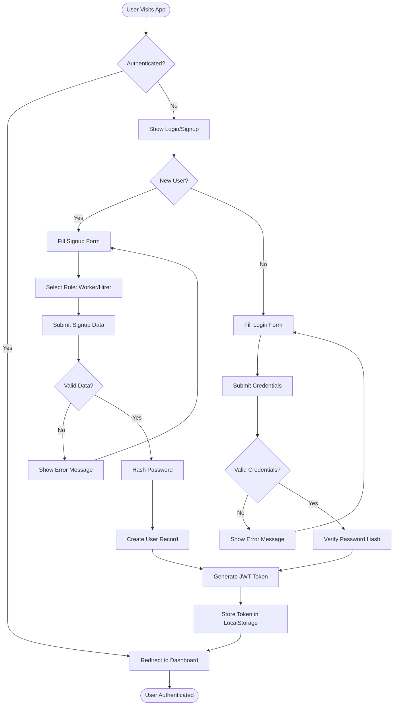

### 9.2 Worker Hiring Process Flow

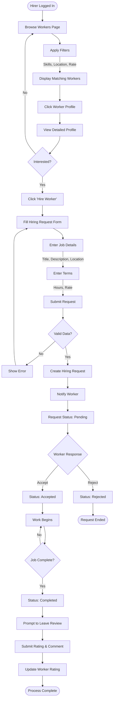

### 9.3 Chat/Messaging Workflow

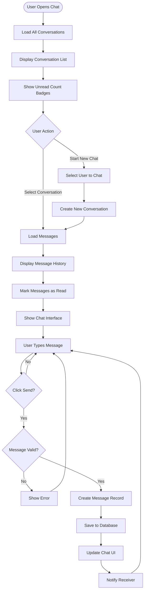

### 9.4 Worker Profile Management Flow

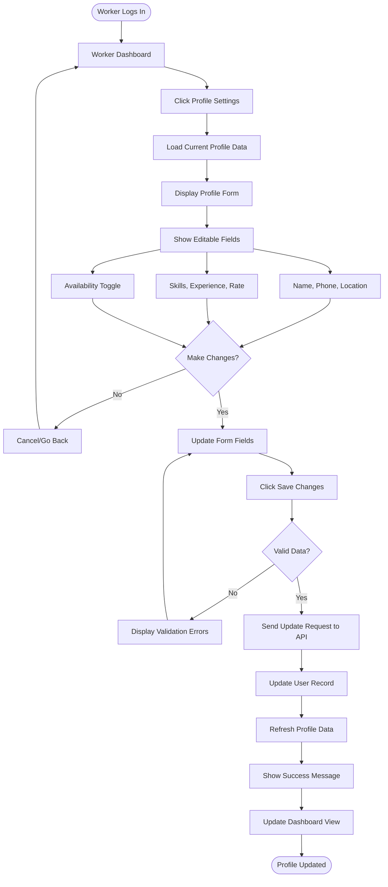

### 9.5 Review Submission Process

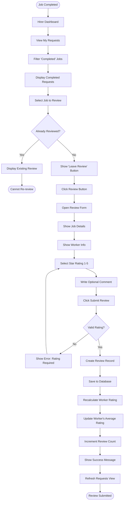

### 9.6 System Data Flow Diagram

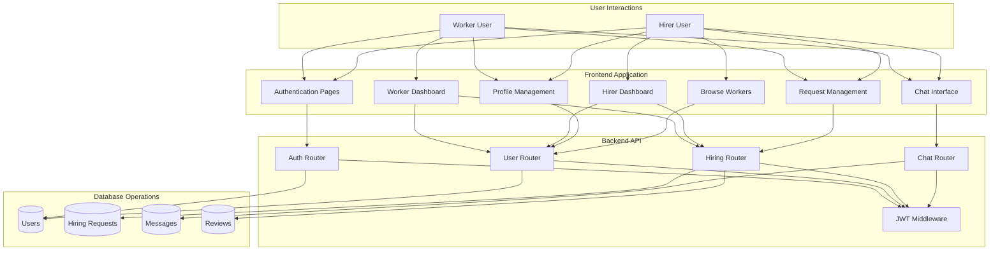

---

## 10. Technology Stack

### 10.1 Backend Technologies

| Technology | Version | Purpose |
|------------|---------|---------|
| **Python** | 3.8+ | Programming language |
| **FastAPI** | 0.104.1 | Modern web framework for building APIs |
| **SQLAlchemy** | 2.0.23 | ORM for database operations |
| **SQLite** | 3.x | Lightweight relational database |
| **python-jose** | 3.3.0 | JWT token generation and validation |
| **passlib** | 1.7.4 | Password hashing with bcrypt |
| **python-dotenv** | 1.0.0 | Environment variable management |
| **Uvicorn** | Latest | ASGI server for FastAPI |

### 10.2 Frontend Technologies

| Technology | Version | Purpose |
|------------|---------|---------|
| **React.js** | 18.2.0 | UI library for building components |
| **React Router DOM** | 6.20.0 | Client-side routing |
| **Axios** | 1.6.0 | HTTP client for API requests |
| **CSS3** | - | Styling and responsive design |
| **Create React App** | Latest | Build tooling and configuration |

### 10.3 Development Tools

- **Git** - Version control system
- **npm** - Package management
- **VS Code** - Integrated development environment
- **Postman** - API testing and documentation
- **Browser DevTools** - Frontend debugging
- **Swagger UI** - Interactive API documentation

### 10.4 Architecture Patterns

1. **RESTful API Design** - Stateless HTTP endpoints
2. **JWT Authentication** - Token-based security
3. **Component-Based Architecture** - Reusable React components
4. **MVC Pattern** - Model-View-Controller separation
5. **ORM Pattern** - Database abstraction with SQLAlchemy
6. **Repository Pattern** - Data access abstraction

---

## 11. Implementation Details

### 11.1 Backend Implementation

#### **FastAPI Application Structure**

```python
# Main application entry point
from fastapi import FastAPI
from fastapi.middleware.cors import CORSMiddleware

app = FastAPI(title="LaborLink API", version="1.0.0")

# CORS configuration
app.add_middleware(
    CORSMiddleware,
    allow_origins=["http://localhost:3000"],
    allow_credentials=True,
    allow_methods=["*"],
    allow_headers=["*"],
)

# Include routers
app.include_router(auth_router.router)
app.include_router(users.router)
app.include_router(hiring.router)
app.include_router(chat.router)
```

#### **Authentication Implementation**

**Password Hashing:**
```python
from passlib.context import CryptContext

pwd_context = CryptContext(schemes=["bcrypt"], deprecated="auto")

# Hash password on signup
hashed_password = pwd_context.hash(password)

# Verify password on login
pwd_context.verify(password, stored_hash)
```

**JWT Token Generation:**
```python
from jose import jwt
from datetime import datetime, timedelta

def create_access_token(data: dict):
    to_encode = data.copy()
    expire = datetime.utcnow() + timedelta(minutes=30)
    to_encode.update({"exp": expire})
    return jwt.encode(to_encode, SECRET_KEY, algorithm="HS256")
```

#### **Database Models**

```python
from sqlalchemy import Column, Integer, String, Float, Boolean, ForeignKey
from sqlalchemy.orm import relationship

class User(Base):
    __tablename__ = "users"
    
    id = Column(Integer, primary_key=True, index=True)
    name = Column(String, nullable=False)
    email = Column(String, unique=True, nullable=False)
    password = Column(String, nullable=False)
    role = Column(String, nullable=False)  # 'worker' or 'hirer'
    skills = Column(Text)  # JSON string
    hourly_rate = Column(Float)
    rating = Column(Float, default=0.0)
    # ... additional fields
```

### 11.2 Frontend Implementation

#### **React Component Example**

```javascript
import React, { useState, useEffect } from 'react';
import axios from 'axios';

function WorkerDashboard() {
  const [requests, setRequests] = useState([]);
  const [loading, setLoading] = useState(true);

  useEffect(() => {
    fetchRequests();
  }, []);

  const fetchRequests = async () => {
    try {
      const response = await axios.get(`/hiring/requests/worker/${userId}`);
      setRequests(response.data);
      setLoading(false);
    } catch (error) {
      console.error('Error fetching requests:', error);
    }
  };

  return (
    <div className="dashboard">
      {/* Dashboard content */}
    </div>
  );
}
```

#### **API Integration**

```javascript
// Axios instance with JWT token
import axios from 'axios';

const api = axios.create({
  baseURL: process.env.REACT_APP_API_URL || 'http://localhost:8000',
});

// Add token to requests
api.interceptors.request.use(
  (config) => {
    const token = localStorage.getItem('token');
    if (token) {
      config.headers.Authorization = `Bearer ${token}`;
    }
    return config;
  },
  (error) => Promise.reject(error)
);
```

### 11.3 Key Implementation Features

1. **Role-Based Access Control**
   - Routes protected based on user role
   - Backend validation of user permissions
   - Frontend conditional rendering

2. **Real-Time Updates**
   - Automatic data refresh
   - Optimistic UI updates
   - Error handling and retry logic

3. **Data Validation**
   - Pydantic schemas for backend
   - Form validation on frontend
   - Consistent error messages

4. **State Management**
   - LocalStorage for authentication
   - React hooks for component state
   - Context API for global state

---

## 12. Testing and Validation

### 12.1 Testing Strategy

The application was tested through multiple approaches to ensure correct functionality, data integrity, and smooth user interaction.

#### **Testing Methods**

1. **Manual Testing**
   - UI/UX testing on different browsers
   - User flow testing for all features
   - Cross-device compatibility testing

2. **API Testing**
   - Using FastAPI's built-in **Swagger UI** (`/docs`)
   - Testing all endpoints with various inputs
   - Validation of request/response formats

3. **Integration Testing**
   - Testing frontend-backend communication
   - Database operations verification
   - Authentication flow testing

### 12.2 Test Cases

#### **Authentication Testing**
- ✅ User signup with worker role
- ✅ User signup with hirer role
- ✅ Login with valid credentials
- ✅ Login with invalid credentials
- ✅ JWT token generation and validation
- ✅ Protected route access control
- ✅ Token expiration handling

#### **Worker Features Testing**
- ✅ Profile creation and update
- ✅ Skills management (add/remove)
- ✅ Hourly rate setting and display
- ✅ Availability toggle functionality
- ✅ Receiving hiring requests
- ✅ Accepting/rejecting requests
- ✅ View request details

#### **Hirer Features Testing**
- ✅ Browsing all workers
- ✅ Filtering by skills (multiple selection)
- ✅ Filtering by location
- ✅ Filtering by hourly rate range
- ✅ Filtering by minimum rating
- ✅ Viewing detailed worker profiles
- ✅ Sending hiring requests
- ✅ Tracking request status
- ✅ Submitting reviews

#### **Messaging Testing**
- ✅ Starting new conversations
- ✅ Sending messages
- ✅ Receiving messages
- ✅ Message read status updates
- ✅ Unread count accuracy
- ✅ Conversation history persistence
- ✅ Multiple conversations management

#### **Review System Testing**
- ✅ Submitting reviews for completed jobs
- ✅ Rating calculation (average)
- ✅ Review uniqueness validation
- ✅ Rating display on worker profiles
- ✅ Preventing duplicate reviews
- ✅ Comment submission and display

### 12.3 Validation Results

Each module was verified to ensure:
- **Correct Functionality:** All features work as intended
- **Data Integrity:** Database constraints properly enforced
- **Smooth User Interaction:** Responsive UI with appropriate feedback
- **Error Handling:** Graceful handling of edge cases
- **Security:** Authentication and authorization working correctly

### 12.4 API Documentation

The system provides **interactive API documentation** accessible at:
- **Swagger UI:** `http://localhost:8000/docs`
- **ReDoc:** `http://localhost:8000/redoc`

These interfaces allow:
- Viewing all available endpoints
- Testing API calls directly from browser
- Examining request/response schemas
- Understanding authentication requirements
- Viewing detailed error responses

---

## 13. Results and Discussion

### 13.1 Project Results

The Labor-Link application successfully provides a **functional platform for labor-hirer interaction**. The system achieves all primary objectives and demonstrates practical applicability in real-world scenarios.

#### **Key Achievements**

1. **Complete User Management**
   - Users can create profiles with role selection
   - Profile management with comprehensive information
   - Secure authentication and authorization

2. **Service Listing and Discovery**
   - Workers can list their skills and set hourly rates
   - Hirers can easily browse and filter available workers
   - Advanced search functionality with multiple criteria

3. **Job Scheduling and Management**
   - Hirers can send detailed hiring requests
   - Workers can accept or reject requests
   - Status tracking from request to completion

4. **Work History Tracking**
   - Complete record of all hiring requests
   - Job completion tracking
   - Performance metrics (total jobs, ratings)

5. **Communication System**
   - Direct messaging between workers and hirers
   - Conversation history persistence
   - Unread message notifications

6. **Quality Assurance**
   - 5-star rating system
   - Written review comments
   - Automatic rating calculation
   - Review display on worker profiles

### 13.2 Benefits Achieved

#### **For Workers:**
- Increased visibility to potential hirers
- Professional profile showcase
- Transparent wage display
- Work history tracking
- Reputation building through reviews

#### **For Hirers:**
- Easy access to qualified workers
- Ability to filter and search efficiently
- Clear pricing information
- Quality assurance through ratings
- Direct communication channel

#### **For Both Parties:**
- Improved transparency in wage expectations
- Reduced conflicts through clear job descriptions
- Formal record-keeping
- Structured communication
- Trust-building through reviews

### 13.3 System Performance

The system demonstrates:
- **Fast Response Times:** Quick API responses
- **Smooth User Experience:** Responsive frontend
- **Data Consistency:** Reliable database operations
- **Scalability:** Architecture supports growth
- **Maintainability:** Clean, documented code

### 13.4 Discussion

The Labor-Link platform successfully addresses the identified problems in the informal labor market:

1. **Wage Clarity Achieved**
   - Workers display hourly rates upfront
   - Hirers can offer custom rates
   - No hidden costs or surprises

2. **Reliable Scheduling Implemented**
   - Formal hiring request system
   - Status tracking (pending/accepted/completed)
   - Clear job timelines

3. **Formal Work Records Maintained**
   - Complete hiring history
   - Job completion tracking
   - Performance statistics

4. **Enhanced Communication**
   - Direct messaging system
   - Job description clarity
   - Real-time notifications

5. **Trust and Safety Improved**
   - Review and rating system
   - Profile verification potential
   - Dispute minimization through transparency

The system successfully improves transparency and reduces conflicts by clearly defining wages and work schedules, creating a win-win situation for both workers and hirers.

---

## 14. Limitations

While the Labor-Link system successfully achieves its primary objectives, several limitations have been identified for future improvement:

### 14.1 Current Limitations

1. **Database Scalability**
   - SQLite is suitable for development but not production-scale deployment
   - Limited concurrent user support
   - Performance issues with large datasets
   - **Recommendation:** Migrate to PostgreSQL or MySQL for production

2. **Real-Time Communication**
   - Chat uses HTTP polling instead of WebSocket connections
   - Not truly real-time messaging
   - Higher server load due to frequent polling
   - **Recommendation:** Implement WebSocket for instant messaging

3. **No Online Payment Integration**
   - No built-in payment processing
   - Manual payment arrangements required
   - No escrow or payment protection
   - **Recommendation:** Integrate payment gateway (Stripe/PayPal)

4. **No Mobile Application**
   - Web-only platform
   - No native mobile apps (iOS/Android)
   - Limited push notification support
   - **Recommendation:** Develop React Native mobile apps

5. **Limited Notification System**
   - No email notifications for important events
   - No SMS alerts
   - In-app notifications only
   - **Recommendation:** Implement comprehensive notification system

6. **No Image Upload Functionality**
   - No profile pictures
   - No work portfolio images
   - Text-only profiles
   - **Recommendation:** Add file upload and image hosting

7. **Basic Search Functionality**
   - Simple filtering only
   - No advanced search algorithms
   - No location-based radius search
   - **Recommendation:** Implement geolocation and advanced search

8. **No Background Verification**
   - Cannot verify worker credentials
   - No identity verification system
   - Trust based solely on reviews
   - **Recommendation:** Add verification services

### 14.2 Technical Debt

- Code optimization needed for better performance
- Additional unit and integration tests required
- Documentation could be more comprehensive
- Accessibility features could be improved

---

## 15. Future Enhancements

### 15.1 Short-Term Improvements (3-6 months)

1. **Real-Time Communication**
   - Implement WebSocket for instant messaging
   - Add typing indicators
   - Enable message delivery receipts
   - Online/offline status indicators

2. **Enhanced User Experience**
   - Profile picture upload functionality
   - Image compression and optimization
   - Worker portfolio/gallery feature
   - Advanced search with autocomplete

3. **Notification System**
   - Email notifications for:
     - New hiring requests
     - Request status updates
     - New messages
   - SMS alerts for urgent updates
   - In-app notification center with history

4. **Mobile Responsiveness**
   - Optimize UI for mobile devices
   - Improve touch interactions
   - Progressive Web App (PWA) features

### 15.2 Medium-Term Enhancements (6-12 months)

1. **Payment Integration**
   - Integrate payment gateway (Stripe/PayPal/Razorpay)
   - Escrow system for job payments
   - Secure payment processing
   - Automatic payment release on job completion
   - Invoice generation
   - Payment history and receipts

2. **Mobile Applications**
   - React Native iOS app
   - React Native Android app
   - Push notifications
   - Offline mode support
   - Native camera integration for photos

3. **Advanced Analytics**
   - Worker performance metrics dashboard
   - Earnings analytics and trends
   - Hirer activity tracking
   - Platform usage statistics
   - Revenue analytics for monetization

4. **Location-Based Services**
   - GPS integration for location verification
   - Radius-based worker search
   - Map view of nearby workers
   - Distance calculation
   - Route optimization

### 15.3 Long-Term Enhancements (12+ months)

1. **AI/ML Features**
   - Smart worker recommendations for hirers
   - Automatic skill matching algorithms
   - Dynamic pricing suggestions
   - Fraud detection system
   - Sentiment analysis on reviews
   - Chatbot for customer support

2. **Verification and Trust**
   - Background check integration
   - Identity verification (KYC)
   - Skill certification uploads
   - Insurance verification
   - Reference checking system

3. **Platform Monetization**
   - Subscription plans for premium features
   - Commission on completed jobs
   - Featured worker listings
   - Promoted job postings
   - Advertisement opportunities

4. **Advanced Features**
   - **Multi-language Support:** Localization for different regions
   - **Job History Reports:** Automated PDF generation
   - **Dispute Resolution System:** Mediation platform
   - **Insurance Integration:** Job insurance options
   - **Team Hiring:** Ability to hire multiple workers
   - **Recurring Jobs:** Schedule regular services
   - **Calendar Integration:** Google Calendar sync
   - **Video Interviews:** Built-in video calling
   - **Skill Assessment Tests:** Verify worker skills
   - **Contract Templates:** Legal agreement generation

5. **Enterprise Features**
   - Business accounts for companies
   - Bulk hiring capabilities
   - Vendor management
   - Department-wise management
   - Custom billing and invoicing

6. **Scalability Improvements**
   - Migrate to PostgreSQL database
   - Implement caching with Redis
   - Load balancing for high traffic
   - Containerization with Docker
   - Kubernetes for orchestration
   - CDN integration for static assets
   - Microservices architecture

---

## 16. Conclusion

### 16.1 Summary

Labor-Link demonstrates how a **full-stack web application** can effectively address real-world problems related to labor management and hiring in the informal sector. The project successfully bridges the gap between skilled workers seeking employment and individuals or businesses requiring labor services.

By providing **transparency, structured communication, and comprehensive work tracking**, the system offers a practical and scalable solution suitable for further enhancement and real-world deployment. The platform eliminates many pain points of traditional labor hiring, including wage disputes, unreliable scheduling, lack of work records, and poor communication.

### 16.2 Key Accomplishments

The LaborLink platform successfully achieves:

✅ **Functional Marketplace** - Fully operational platform connecting workers and hirers  
✅ **Secure Authentication** - JWT-based security with role-based access control  
✅ **Comprehensive Features** - Complete hiring workflow from discovery to review  
✅ **Real-Time Communication** - Messaging system for direct interaction  
✅ **Quality Assurance** - Review and rating system for trust building  
✅ **Modern Architecture** - Scalable and maintainable codebase  
✅ **Responsive Design** - Works seamlessly on desktop and mobile devices  
✅ **Network Accessibility** - Supports cross-device and LAN access  

### 16.3 Technical Learning

This project provided valuable experience in:
- **Full-stack web development** with modern technologies
- **RESTful API design** and implementation
- **Database schema design** with proper relationships
- **Authentication and authorization** mechanisms
- **Frontend frameworks** (React.js) and state management
- **Software architecture** and design patterns
- **Version control** with Git
- **API documentation** using Swagger UI

### 16.4 Impact and Value

The LaborLink system provides tangible benefits:

**For Workers:**
- Professional platform to showcase skills
- Increased job opportunities
- Fair wage transparency
- Reputation building through reviews

**For Hirers:**
- Easy access to qualified workers
- Quality assurance through ratings
- Time savings in worker discovery
- Clear communication channels

**For Society:**
- Formalization of informal labor market
- Economic empowerment of workers
- Transparency in labor transactions
- Digital transformation of traditional processes

### 16.5 Deployment Readiness

While the current version is fully functional for demonstration and testing, several enhancements are recommended before production deployment:
- Database migration to PostgreSQL
- Implementation of payment gateway
- Enhanced security measures
- Real-time notification system
- Mobile application development

### 16.6 Final Remarks

LaborLink demonstrates a **comprehensive understanding of modern web development practices** and successfully addresses real-world problems in the labor marketplace domain. The platform provides a **solid foundation** that can be expanded with the proposed future enhancements to create a production-ready, scalable application.

The modular architecture ensures easy maintenance and scalability, while the comprehensive documentation facilitates future development and onboarding of new team members. With the addition of payment integration, mobile apps, and advanced features, LaborLink has the potential to become a **widely-used platform** for labor hiring and management.

This project not only fulfills the academic requirements of the Capstone Engineering Project but also presents a **viable business opportunity** with real-world applicability and social impact.

---

## 17. References and Appendices

### 17.1 References

1. **FastAPI Documentation** - https://fastapi.tiangolo.com/
2. **React.js Documentation** - https://react.dev/
3. **SQLAlchemy Documentation** - https://docs.sqlalchemy.org/
4. **JWT.io** - JSON Web Token Information - https://jwt.io/
5. **REST API Best Practices** - https://restfulapi.net/

### 17.2 Appendix A: Installation Instructions

#### **Prerequisites:**
- Python 3.8 or higher
- Node.js 14 or higher
- npm or yarn package manager

#### **Backend Setup:**

1. Navigate to backend directory:
   ```bash
   cd backend
   ```

2. Create virtual environment:
   ```bash
   python -m venv venv
   
   # Windows
   venv\Scripts\activate
   
   # Linux/Mac
   source venv/bin/activate
   ```

3. Install dependencies:
   ```bash
   pip install -r requirements.txt
   ```

4. Set up environment variables:
   - Copy `.env.example` to `.env`
   - Update SECRET_KEY and other settings

5. Initialize database:
   ```bash
   python migrate_database.py
   ```

6. Start backend server:
   ```bash
   python -m uvicorn app.main:app --reload --host 0.0.0.0 --port 8000
   ```

#### **Frontend Setup:**

1. Navigate to frontend directory:
   ```bash
   cd frontend
   ```

2. Install dependencies:
   ```bash
   npm install
   ```

3. Configure API URL (optional):
   - Create `.env` file
   - Add: `REACT_APP_API_URL=http://localhost:8000`

4. Start frontend server:
   ```bash
   npm start
   ```

### 17.3 Appendix B: Environment Variables

**Backend (.env):**
```env
DATABASE_URL=sqlite:///./laborlink.db
SECRET_KEY=your-secret-key-change-this-in-production
ALGORITHM=HS256
ACCESS_TOKEN_EXPIRE_MINUTES=30
CORS_ORIGINS=http://localhost:3000,http://127.0.0.1:3000
HOST=0.0.0.0
PORT=8000
```

**Frontend (.env):**
```env
REACT_APP_API_URL=http://localhost:8000
# For network access:
# REACT_APP_API_URL=http://YOUR_IP_ADDRESS:8000
```

### 17.4 Appendix C: Project File Structure

```
CEPLabor_Link_Python/
├── backend/
│   ├── app/
│   │   ├── auth/
│   │   │   ├── auth_router.py      # Authentication endpoints
│   │   │   └── hashing.py          # Password hashing utilities
│   │   ├── routers/
│   │   │   ├── users.py            # User management endpoints
│   │   │   ├── hiring.py           # Hiring & review endpoints
│   │   │   ├── chat.py             # Messaging endpoints
│   │   │   └── services.py         # Service listings
│   │   ├── utils/
│   │   │   ├── helpers.py          # Utility functions
│   │   │   └── notifications.py    # Notification helpers
│   │   ├── models.py               # SQLAlchemy models
│   │   ├── schemas.py              # Pydantic schemas
│   │   ├── database.py             # Database configuration
│   │   └── main.py                 # FastAPI app entry point
│   ├── laborlink.db                # SQLite database file
│   ├── migrate_database.py         # Database migration script
│   └── requirements.txt            # Python dependencies
├── frontend/
│   ├── public/
│   │   ├── index.html              # HTML template
│   │   └── favicon.ico             # Favicon
│   ├── src/
│   │   ├── components/
│   │   │   └── Navbar.jsx          # Navigation component
│   │   ├── pages/
│   │   │   ├── Login.jsx           # Login page
│   │   │   ├── Signup.jsx          # Registration page
│   │   │   ├── Dashboard.jsx       # Main dashboard
│   │   │   ├── WorkerDashboard.jsx # Worker dashboard
│   │   │   ├── HirerDashboard.jsx  # Hirer dashboard
│   │   │   ├── BrowseWorkers.jsx   # Worker search
│   │   │   ├── WorkerProfile.jsx   # Worker profile view
│   │   │   ├── Profile.jsx         # Profile management
│   │   │   ├── HireWorker.jsx      # Hiring request form
│   │   │   ├── MyRequests.jsx      # Hirer requests
│   │   │   ├── WorkerRequests.jsx  # Worker requests
│   │   │   ├── Chat.jsx            # Chat interface
│   │   │   └── ReviewForm.jsx      # Review submission
│   │   ├── styles/
│   │   │   └── dashboard.css       # Main stylesheet
│   │   ├── api.js                  # Axios configuration
│   │   ├── App.js                  # Main app component
│   │   └── index.js                # React entry point
│   ├── package.json                # Node dependencies
│   └── .env                        # Environment variables
├── .env.example                     # Example environment file
├── .gitignore                       # Git ignore rules
├── README.md                        # Project documentation
└── CEP_Report_LaborLink.md         # This report
```

### 17.5 Appendix D: API Response Examples

**User Response:**
```json
{
  "id": 1,
  "name": "John Doe",
  "email": "john@example.com",
  "role": "worker",
  "phone": "+1234567890",
  "location": "New York",
  "experience": 5,
  "skills": ["Plumbing", "Electrical", "Carpentry"],
  "hourly_rate": 25.0,
  "is_available": true,
  "rating": 4.5,
  "total_jobs": 12,
  "created_at": "2026-01-01T00:00:00Z"
}
```

**Hiring Request Response:**
```json
{
  "id": 1,
  "hirer_id": 2,
  "worker_id": 1,
  "job_title": "Fix Kitchen Sink",
  "job_description": "Repair leaking kitchen sink and replace faucet",
  "job_location": "123 Main St, New York",
  "estimated_hours": 3.0,
  "offered_rate": 30.0,
  "status": "pending",
  "created_at": "2026-01-02T10:00:00Z",
  "hirer": { /* hirer user object */ },
  "worker": { /* worker user object */ }
}
```

### 17.6 Appendix E: Glossary

| Term | Definition |
|------|------------|
| **API** | Application Programming Interface |
| **CORS** | Cross-Origin Resource Sharing |
| **JWT** | JSON Web Token |
| **ORM** | Object-Relational Mapping |
| **REST** | Representational State Transfer |
| **RBAC** | Role-Based Access Control |
| **UI** | User Interface |
| **UX** | User Experience |
| **SPA** | Single Page Application |

---

**Report Prepared By:** [Student Name]  
**Student ID:** [Your Student ID]  
**Project Supervisor:** [Supervisor Name]  
**Institution:** [University Name]  
**Department:** Computer Engineering  
**Course:** Capstone Engineering Project (CEP)  
**Semester:** 5th Semester  
**Date:** January 2, 2026

---

**End of Report**
